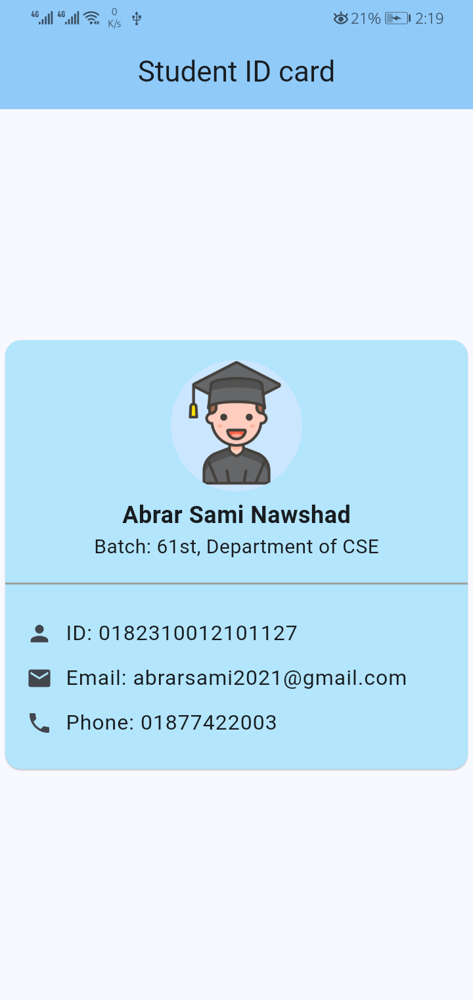

# Flutter ID Card App

This is a simple Flutter app that shows a basic student ID card.

## What it does:

*   Displays a name and ID.
*   Shows a profile picture in a circle.
*   Has a light blue(shade: 200) bar.
*   The "DEBUG" banner in the corner is turned off.

## Screenshot

